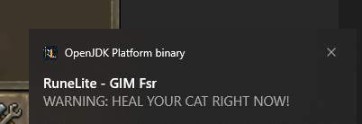

# Cat V Rat Runelite Plugin
___
This repository contains the Cat V Rat plugin for the OSRS Runelite Client. 

  

Fighting Hell-Rat Behemoths on OSRS can be a big hassle when you have to monitor your cat's health, especially when fights take several minutes to complete.
Accidentally letting your cat die can mean a 6-hour tax to grow one back up to a Wily Cat. To avoid accidentally losing cats, this plugin was created to help monitor and alert users to heal their cats when they reach <60% and <30% health. 

  

___

## User Features

The plugin can alert the user in the following ways:
- Flashing Hint Arrow / Tile Markers / Karambwanji Sprite

  

- Chat notifications

  

- OS notifications

  

- Overlay Boxes

  

___

## Development

Want to contribute? Great!

Email [Gunner](https://github.com/GunnerStone) for collaborator access or fork and make your own version!
## License

MIT

